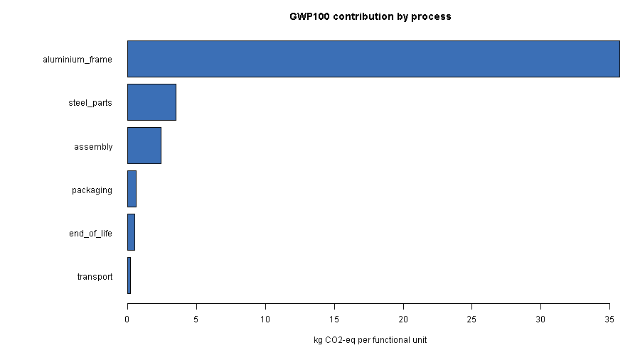
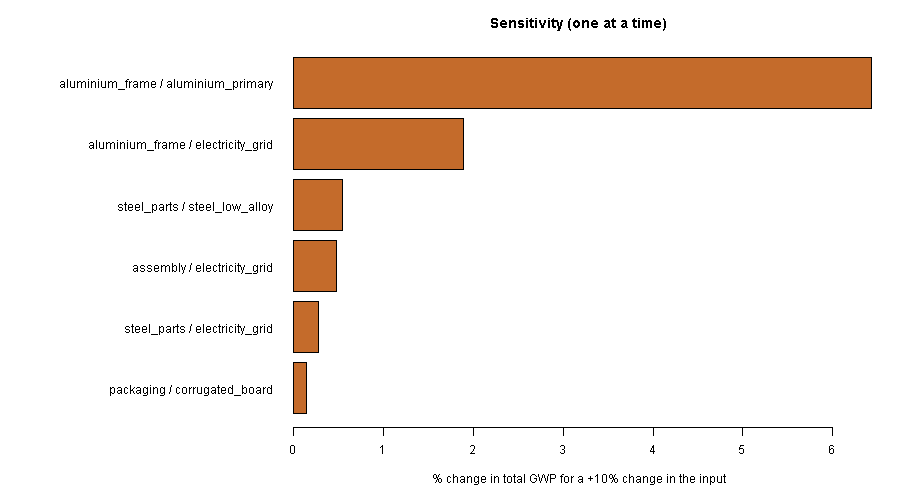

# LCA analysis pipeline in R - worked example

A small, reusable R workflow for life cycle assessment: clean and validate an
inventory, characterise impacts, run Monte Carlo uncertainty, one-at-a-time
sensitivity and a scenario, and write tables and charts. Sample data (a
product with an aluminium frame), base R only, runs in a few seconds:

```
Rscript lca_pipeline.R
```

## Inputs

- `inventory.csv` - process, flow, amount, unit, and a geometric standard
  deviation (`gsd`) per row for uncertainty.
- `factors.csv` - characterisation factors per flow and impact category
  (GWP100 and acidification here; any category list works).

The loader refuses bad input instead of producing a wrong number: negative
amounts, a gsd below 1, duplicate process/flow rows, or a flow with no
characterisation factor all stop the run with a message naming the problem.

## Results on the sample data

| Category | Deterministic | Monte Carlo mean | 90% interval |
|---|---|---|---|
| GWP100 (kg CO2-eq) | 42.94 | 43.38 | 38.44 - 48.70 |
| Acidification (mol H+-eq) | 0.196 | 0.197 | 0.175 - 0.222 |

- **Hotspot:** primary aluminium in the frame. A 10% change in that one input
  moves total GWP by 6.4%; the next driver (the frame's grid electricity)
  moves it 1.9%.
- **Scenario:** switching all grid electricity to renewable cuts GWP from
  42.9 to 32.4 kg CO2-eq (about 25% lower) and acidification by about 24%.
- **Uncertainty:** the Monte Carlo mean sits slightly above the deterministic
  value, as expected for lognormal inputs.




## Functions

| Function | Does |
|---|---|
| `read_inputs()` | loads and validates both files |
| `characterise()` | impact per process and category |
| `monte_carlo(n)` | lognormal draws per inventory row, summary per category |
| `sensitivity(delta)` | +delta on each row, % change in each total |
| `scenario_swap(from, to)` | replaces a flow, for what-if runs |

Every function takes and returns plain data frames, so it slots into a
tidyverse or data.table workflow as is.
